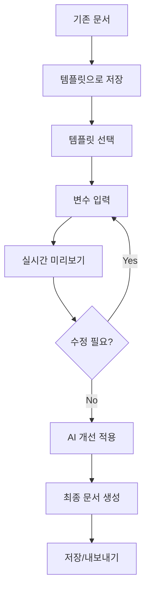

# AAWGA 개발 우선순위 및 문서·UI 검토 개선사항 (2025-08-01) - Enhanced

## 📄 템플릿 적용 문서 생성 시스템 (신규 추가)

### ✏️ 사용자 수정 기능 (신규 반영)

#### (1) 미리보기에서 직접 수정
- `LexicalEditor` 컴포넌트를 readOnly=false 설정하여 직접 편집 가능
- 사용자는 직접 내용을 수정 후 저장 가능
- 향후 버전 비교 및 히스토리 관리 가능성 검토

#### (2) LLM에게 자연어로 수정 지시
- "이 문장을 더 간결하게 바꿔줘", "항목 2번 삭제해줘" 등 자연어 지시 입력
- FastAPI `/api/documents/edit-with-llm` 엔드포인트를 통해 LLM 호출
- 수정된 결과를 에디터에 반영하여 사용자 확인 후 저장 가능

#### 📌 예시 API
```python
@router.post("/api/documents/edit-with-llm")
async def edit_document_with_llm(document_text: str, user_command: str):
    """사용자 지시 기반 문서 수정"""
    response = await call_llm_edit_agent(document_text, user_command)
    return { "edited_text": response }
```


### 🎯 핵심 기능 설계

**워크플로우**:
```
1. 템플릿 선택 → 2. 데이터 입력 → 3. 실시간 생성 → 4. 미리보기 → 5. 사용자 수정 (직접 또는 LLM 지시) → 6. 저장/내보내기
```

### 🔧 기술적 구현

#### **1. 템플릿 엔진 아키텍처**
```typescript
interface DocumentTemplate {
  id: string;
  name: string;
  description: string;
  template_type: 'requirement' | 'testcase' | 'traceability' | 'custom';
  template_content: string;  // Handlebars/Mustache 템플릿
  variables: TemplateVariable[];
  created_at: Date;
  updated_at: Date;
}

interface TemplateVariable {
  name: string;
  type: 'text' | 'number' | 'date' | 'list' | 'object';
  required: boolean;
  default_value?: any;
  description?: string;
}
```

#### **2. FastAPI 엔드포인트 확장**
```python
# backend/routes/document_generation.py
@router.post("/api/documents/generate")
async def generate_document(
    template_id: str,
    input_data: Dict[str, Any],
    output_format: str = "markdown"
):
    """템플릿을 적용하여 문서 생성"""
    template = await get_template_by_id(template_id)
    
    # 템플릿 엔진 적용 (Jinja2/Handlebars)
    rendered_content = render_template(template.content, input_data)
    
    # AI Agent 처리 (선택적)
    if template.use_ai_enhancement:
        enhanced_content = await process_with_agent(rendered_content, template.agent_type)
        rendered_content = enhanced_content
    
    # 포맷 변환
    if output_format == "pdf":
        document = convert_to_pdf(rendered_content)
    elif output_format == "docx":
        document = convert_to_docx(rendered_content)
    else:
        document = rendered_content
    
    return {
        "generated_content": document,
        "template_applied": template.name,
        "generation_time": datetime.now()
    }

@router.get("/api/documents/preview")
async def preview_document(
    template_id: str,
    input_data: Dict[str, Any]
):
    """실시간 미리보기"""
    template = await get_template_by_id(template_id)
    preview_content = render_template(template.content, input_data)
    
    return {
        "preview_content": preview_content,
        "variables_used": extract_variables(input_data)
    }
```

#### **3. React 컴포넌트 설계**
```typescript
// src/components/DocumentGenerator.tsx
const DocumentGenerator: React.FC = () => {
  const [selectedTemplate, setSelectedTemplate] = useState<DocumentTemplate | null>(null);
  const [inputData, setInputData] = useState<Record<string, any>>({});
  const [previewContent, setPreviewContent] = useState<string>('');
  const [isGenerating, setIsGenerating] = useState(false);

  // 실시간 미리보기
  const { data: preview } = useQuery({
    queryKey: ['preview', selectedTemplate?.id, inputData],
    queryFn: () => generatePreview(selectedTemplate!.id, inputData),
    enabled: !!selectedTemplate && Object.keys(inputData).length > 0,
    refetchInterval: 1000 // 1초마다 업데이트
  });

  const handleGenerate = async (outputFormat: string) => {
    setIsGenerating(true);
    try {
      const result = await generateDocument(selectedTemplate!.id, inputData, outputFormat);
      // 생성된 문서 처리
      downloadDocument(result.generated_content, outputFormat);
    } finally {
      setIsGenerating(false);
    }
  };

  return (
    <div className="document-generator">
      <TemplateSelector 
        onSelect={setSelectedTemplate}
        selectedTemplate={selectedTemplate}
      />
      
      {selectedTemplate && (
        <>
          <VariableInputForm
            template={selectedTemplate}
            inputData={inputData}
            onChange={setInputData}
          />
          
          <div className="preview-section">
            <h3>실시간 미리보기</h3>
            <div className="preview-content">
              {preview?.preview_content && (
                <LexicalEditor
                  initialContent={preview.preview_content}
                  readOnly={true}
                />
              )}
            </div>
          </div>
          
          <div className="generation-controls">
            <button onClick={() => handleGenerate('markdown')}>
              Markdown 생성
            </button>
            <button onClick={() => handleGenerate('pdf')}>
              PDF 생성
            </button>
            <button onClick={() => handleGenerate('docx')}>
              Word 생성
            </button>
          </div>
        </>
      )}
    </div>
  );
};
```

#### **4. 템플릿 변수 동적 폼 생성**
```typescript
// src/components/VariableInputForm.tsx
const VariableInputForm: React.FC<{
  template: DocumentTemplate;
  inputData: Record<string, any>;
  onChange: (data: Record<string, any>) => void;
}> = ({ template, inputData, onChange }) => {
  
  const renderInput = (variable: TemplateVariable) => {
    switch (variable.type) {
      case 'text':
        return (
          <input
            type="text"
            value={inputData[variable.name] || ''}
            onChange={(e) => updateField(variable.name, e.target.value)}
            placeholder={variable.description}
            required={variable.required}
          />
        );
      
      case 'list':
        return (
          <ArrayInput
            value={inputData[variable.name] || []}
            onChange={(value) => updateField(variable.name, value)}
            placeholder={`${variable.description} (쉼표로 구분)`}
          />
        );
      
      case 'date':
        return (
          <input
            type="date"
            value={inputData[variable.name] || ''}
            onChange={(e) => updateField(variable.name, e.target.value)}
            required={variable.required}
          />
        );
      
      default:
        return <input type="text" />;
    }
  };

  const updateField = (name: string, value: any) => {
    onChange({
      ...inputData,
      [name]: value
    });
  };

  return (
    <form className="variable-input-form">
      {template.variables.map((variable) => (
        <div key={variable.name} className="form-field">
          <label>
            {variable.name}
            {variable.required && <span className="required">*</span>}
          </label>
          {renderInput(variable)}
          {variable.description && (
            <small className="field-description">{variable.description}</small>
          )}
        </div>
      ))}
    </form>
  );
};
```

### 📊 템플릿 예시

#### **요구사항 문서 템플릿**
```handlebars
# {{project_name}} 요구사항 명세서

## 1. 프로젝트 개요
- **프로젝트명**: {{project_name}}
- **작성일**: {{created_date}}
- **작성자**: {{author}}
- **버전**: {{version}}

## 2. 기능 요구사항
{{#each functional_requirements}}
### {{@index}}. {{this.title}}
**설명**: {{this.description}}
**우선순위**: {{this.priority}}
**담당자**: {{this.assignee}}

{{#if this.acceptance_criteria}}
**인수 기준**:
{{#each this.acceptance_criteria}}
- {{this}}
{{/each}}
{{/if}}

{{/each}}

## 3. 비기능 요구사항
{{#each non_functional_requirements}}
- **{{this.category}}**: {{this.description}}
{{/each}}
```

#### **테스트케이스 템플릿**
```handlebars
# {{test_suite_name}} 테스트케이스

{{#each test_cases}}
## TC-{{@index}}: {{this.title}}

**테스트 목적**: {{this.purpose}}
**전제 조건**: {{this.preconditions}}
**우선순위**: {{this.priority}}

### 테스트 단계
{{#each this.steps}}
{{@index}}. {{this.action}}
   - **예상 결과**: {{this.expected_result}}
{{/each}}

**통과 기준**: {{this.pass_criteria}}

### 🚀 현재 작동 방식 (GitHub 코드 기반)

#### **사용자 워크플로우**
1. **Streamlit 앱 접속**: `streamlit run streamlit_app/main.py`
2. **파일 업로드**: 사업계획서(PDF/DOCX/XLSX) 또는 요구사항 파일 업로드
3. **자동 처리**: 
   - 사업계획서 → 요구사항 + 테스트케이스 + 추적성 매트릭스 생성
   - 요구사항 파일 → 테스트케이스 + 추적성 매트릭스만 생성
4. **템플릿 적용**: 저장된 템플릿 선택하여 결과물 커스터마이징
5. **결과 확인**: Streamlit UI에서 생성된 문서 확인 및 다운로드

#### **기술적 처리 플로우**
```
문서 업로드 → 파싱 → 청킹 → 임베딩 → 벡터 검색 → 에이전트 실행 → 결과 생성
```

---
{{/each}}
```

### 🎛 사용자 인터페이스

#### **템플릿 선택 화면**
```typescript
const TemplateSelector = () => (
  <div className="template-gallery">
    <div className="template-categories">
      <button className="category-tab active">요구사항</button>
      <button className="category-tab">테스트케이스</button>
      <button className="category-tab">추적성</button>
      <button className="category-tab">커스텀</button>
    </div>
    
    <div className="template-grid">
      {templates.map(template => (
        <div key={template.id} className="template-card">
          <h3>{template.name}</h3>
          <p>{template.description}</p>
          <div className="template-meta">
            <span>변수: {template.variables.length}개</span>
            <span>사용횟수: {template.usage_count}</span>
          </div>
          <button onClick={() => selectTemplate(template)}>
            선택
          </button>
        </div>
      ))}
    </div>
  </div>
);
```

### 🔄 워크플로우 통합



---

## 📁 현재 프로젝트 구조 (GitHub 기반)

```
AAWG/
├── streamlit_app/          # Streamlit UI 및 사용자 인터랙션
│   ├── main.py
│   └── pages/             # 업로드, 피드백 폼 페이지
├── backend/               # FastAPI 백엔드
│   ├── app.py            # FastAPI 메인 애플리케이션
│   ├── routers/          # API 라우터 모듈
│   └── services/         # RAG 검색 서비스 (rag_search.py)
├── agents/               # AI 에이전트 모듈
│   ├── requirements_agent.py     # 요구사항 생성 에이전트
│   ├── testcase_agent.py        # 테스트케이스 생성 에이전트
│   └── traceability_agent.py    # 추적성 매트릭스 에이전트
├── models/               # 데이터 모델
│   ├── db_models.py      # Pydantic 스키마
│   └── mongodb_schema.py # MongoDB 스키마
├── scripts/              # 배포 및 유틸리티 스크립트
│   ├── Dockerfile
│   └── docker-compose.yml
├── requirements.txt      # Python 의존성
├── .env.example         # 환경변수 템플릿
└── LICENSE              # MIT License
```

### 🔧 현재 기술 스택
- **프론트엔드**: Streamlit (UI 및 사용자 인터랙션)
- **백엔드**: FastAPI (REST API)
- **AI 프레임워크**: LangChain Agent Manager
- **벡터 DB**: FAISS (로컬) / Pinecone/Weaviate (외부)
- **데이터베이스**: MongoDB Atlas
- **파일 지원**: txt, docx, pdf, xlsx, xls

---

### 1. 기술 구현 관점

## 📌 관점별 정리

### 1. 기술 구현 관점

#### ✅ 완료 (GitHub 저장소 기준)

- **문서 처리 시스템**: txt, docx, pdf, xlsx, xls 포맷 파싱 구현
- **RAG 검색 모듈**: FAISS 연동 및 문서 청킹·임베딩 완료
- **3개 AI Agent 구현**: 
  - `agents/requirements_agent.py`: RAG 기반 요구사항 자동 생성
  - `agents/testcase_agent.py`: 정의된 요구사항 기반 테스트케이스 생성
  - `agents/traceability_agent.py`: 요구사항-테스트케이스 매핑 생성
- **FastAPI 백엔드**: `backend/app.py` 및 라우터 구조 완성
- **Streamlit UI**: 파일 업로드 및 결과 표시 인터페이스 구현
- **템플릿 관리 시스템**: MongoDB Atlas 기반 CRUD 구현
- **Docker 컨테이너화**: Dockerfile 및 docker-compose.yml 완성
- **환경 변수 관리**: .env.example 템플릿 제공

#### 🔜 예정

- **React UI 전환** (Streamlit → React 마이그레이션)
- **Lexical 에디터 통합** (코어 + 기본 툴바부터 시작)
- OpenAI Embeddings 실제 연동 및 환각 대응 전략
- Pinecone/Weaviate 연동 검토
- 성능 최적화, 로깅 및 예외 처리 통합
- CI/CD 자동 배포 구성

### 2. 제품 기능 관점

#### ✅ 완료 (GitHub 저장소 기준)

- **핵심 기능 구현**: 
  - 완전 자동 생성: 사업계획서 → 요구사항 + TC + 추적성
  - 부분 생성: 요구사항 → TC + 추적성
- **템플릿 시스템**: MongoDB Atlas 기반 템플릿 저장 및 적용
- **피드백 시스템**: 기본적인 피드백 수집 구조

#### 🔜 예정

- **템플릿 적용 문서 생성 시스템** (핵심 기능)
  - 저장된 템플릿 목록 조회 및 선택
  - 템플릿 + 입력 데이터 → 자동 문서 생성
  - 실시간 미리보기 및 수정 기능
  - 생성된 문서 저장/내보내기 (PDF, DOCX, MD)
- **고성능 텍스트 에디터 구현** (Lexical 기반)
  - 코어 기능: 기본 텍스트 편집, 포맷팅
  - 확장 기능: 히스토리, 자동저장, 협업 편집
- 사용자 커스터마이징 (포맷 선택, 출력 형태 설정)
- 피드백 기반 생성 결과 수정 기능 구현
- 다국어 지원 기능 검토
- 대시보드 및 통계 기능

### 3. 시스템 아키텍처 및 배포 관점

#### ✅ 완료

- Streamlit UI + FastAPI backend 기본 아키텍처 구성
- LangChain Agent 구조 설계 및 작동 확인
- **FastAPI 서버 정상 실행** ([http://localhost:8000](http://localhost:8000))
- **API 엔드포인트 구조 완성** (templates, feedback, run)
- **Docker Compose를 통한 전체 서비스 통합 실행**
- **MongoDB Atlas 프로덕션 환경 연동**

#### 🔜 예정

- **React + Lexical 아키텍처 전환**
  - 프론트엔드: React 18 + TypeScript + Lexical Editor
  - 빌드 도구: Vite 또는 Create React App
  - 상태 관리: Redux Toolkit 또는 Zustand
- 인증 시스템 연동 (Auth0/Firebase)
- 배포 자동화 (GitHub Actions)
- 모니터링 시스템 (Prometheus, Grafana)
- 로드 밸런싱 및 스케일링 구성

#### 🚀 배포 계획

- **UI 배포 (프론트엔드)**: React 기반 웹 앱으로 재구성
  - 빌드 결과물을 Nginx가 포함된 Docker 컨테이너로 서빙
  - 정적 호스팅: AWS S3 + CloudFront 또는 GCP Cloud Storage + CDN 연동
  - CI 파이프라인에서 `npm run build` 후 Docker 이미지 자동 생성
- **클라우드 플랫폼**: AWS (EKS 클러스터) / GCP (Cloud Run) 중 우선 검토
- **컨테이너 레지스트리**: AWS ECR 혹은 Docker Hub 사용
- **인프라 관리**: Terraform으로 IaC 정의 (VPC, EKS, RDS, S3)
- **CI/CD**: GitHub Actions → Terraform 배포 → Kubernetes Rollout 자동화
- **네트워킹**: AWS ALB (Application Load Balancer) 또는 GCP Cloud Load Balancer
- **도메인 & SSL**: Route 53 + ACM(또는 Let's Encrypt)로 HTTPS 적용
- **로그 & 모니터링**: CloudWatch / Stackdriver / Grafana 대시보드 연동
- **스케일링 정책**: HPA(Horizontal Pod Autoscaler) 설정 (CPU 60%, 메모리 70%)

### 4. 운영 및 품질 관점

#### ✅ 완료

- 일부 유닛 테스트 수행
- 요구사항 > TC 생성 연결 흐름 점검
- **Pydantic v2 호환성 문제 해결**
- **LangChain 임포트 경고 해결**
- **Docker 환경에서의 서비스 통합 테스트**

#### 🔜 예정

- 전체 단위/통합 테스트 커버리지 90% 이상 확보
- **React 컴포넌트 테스트** (Jest + React Testing Library)
- **Lexical 에디터 E2E 테스트** (Playwright 또는 Cypress)
- 템플릿 적용 결함 수정 (예: 요구사항 사라짐 문제)
- 문서 수정 결과 추적 및 동기화 기능 구현
- 성능 테스트 및 최적화

### 5. 라이선스 관리 관점

#### ✅ 고려 사항

- **GPL 계열 라이선스 피하기**: 퍼미시브 라이선스(예: MIT, Apache 2.0) 사용 권장
- **Lexical 라이선스 확인**: MIT 라이선스로 상용 사용 가능 확인됨
- **오픈소스 검증 프로세스 수립**: OSS 스캔 툴(예: FOSSA, OSS Review Toolkit) 연동
- **상용 컴포넌트 라이선스 확인**: 외부 상용 라이브러리 사용 시 라이선스 조건 검토

---

## 🚨 해결된 주요 오류들

1. **Pydantic v2 호환성 문제** ✅
   - **문제**: `__modify_schema__` 메서드 deprecated
   - **해결**: `__get_pydantic_json_schema__` 사용으로 교체
   - **파일**: `models/db_models.py`

2. **LangChain 임포트 경고** ✅
   - **문제**: `langchain.embeddings.openai` deprecated
   - **해결**: `langchain_community.embeddings.OpenAIEmbeddings`로 변경
   - **파일**: `backend/services/rag_search.py`

3. **FastAPI 서버 시작 오류** ✅
   - **문제**: `ModuleNotFoundError: No module named 'agents'`
   - **해결**: `sys.path` 조정으로 import 경로 등록
   - **파일**: `backend/app.py`

4. **MongoDB 연결 문제** ✅
   - **문제**: 로컬 연결 실패
   - **해결**: MongoDB Atlas 전환 & graceful degradation
   - **파일**: `backend/services/database.py`

5. **Docker 컨테이너화 문제** ✅
   - **문제**: 멀티 서비스 환경 설정 복잡
   - **해결**: Docker Compose 통합 실행, env 표준화
   - **파일**: `docker-compose.yml`, `Dockerfile`

---

## 📝 Lexical 에디터 도입 전략

### 🎯 선택 근거

**성능 및 경량화**
- 신뢰성, 접근성, 성능에 중점을 둔 확장 가능한 JavaScript 웹 텍스트 에디터
- 최신 버전 활발한 개발 상태로 지속적인 업데이트 보장

**라이선스 호환성**
- MIT 라이선스로 상용 사용 가능
- Facebook 개발로 안정성 및 지속성 보장

**확장성**
- 고도로 확장 가능한 아키텍처
- 플러그인 시스템으로 필요 기능만 선택적 추가 가능

### 🚀 단계별 구현 계획

#### Phase 1: 기본 구현 (2주)
```typescript
// 기본 Lexical 설정
const initialConfig = {
  namespace: 'AAWGA-Editor',
  theme: customTheme,
  onError: (error) => console.error(error),
  nodes: [
    HeadingNode,
    ListNode,
    ListItemNode,
    QuoteNode,
    CodeNode,
    CodeHighlightNode,
    TableNode,
    TableCellNode,
    TableRowNode,
    LinkNode
  ]
};
```

**구현 목표**:
- 코어 Lexical + 기본 툴바
- 텍스트 포맷팅 (굵게, 기울임, 밑줄)
- 기본 블록 요소 (제목, 목록, 인용)

#### Phase 2: 고급 기능 (3주)
- 히스토리 플러그인 (실행 취소/다시 실행)
- 자동저장 기능
- 실시간 협업 편집 (선택사항)

#### Phase 3: 최적화 및 확장 (2주)
- 성능 최적화
- 접근성 개선 (ARIA 속성)
- 커스텀 플러그인 개발

### 📊 성능 벤치마크 목표

| 메트릭 | 목표 | 측정 방법 |
|--------|------|-----------|
| 초기 로딩 | < 200ms | Lighthouse Performance |
| 대용량 문서 처리 | < 500ms (10MB 텍스트) | 커스텀 벤치마크 |
| 메모리 사용량 | < 50MB | Chrome DevTools |
| 타이핑 지연 | < 16ms (60fps) | Performance API |

---

## 🔍 저장소 트리 구현 전략 (보완)

```
소규모 (<1,000 파일): 실시간 파일 스캔 + 메모리 캐싱(30분)
중규모 (1,000~10,000 파일): 캐시 + 주기적 동기화(1시간) + 파일 watcher
대규모 (>10,000 파일): DB 인덱스 + 실시간 변경 감지 + 백그라운드 동기화
```

### 세부 방안

- **프로토타입**: `os.walk()` 기반 FastAPI `/files/tree` → JSON 반환
- **단계별 전환**: 캐시 도입 → DB 테이블(`documents`)에 메타데이터 인덱싱 → CTE 쿼리 사용
- **평가 지표**: 파일 트리 로딩 시간 (<500ms), 변경 반영 지연 (<5분)

---

## 🖥 UI 구현 현황 & 미구현 항목

| 영역 | 기능 | 상태 | 우선순위 | 비고 |
|------|------|------|----------|------|
| **아키텍처** | React 전환 | ❌ 미구현 | 🔥 최우선 | Streamlit → React 마이그레이션 |
| **문서 생성** | 템플릿 적용 생성 | ❌ 미구현 | 🔥 최우선 | Handlebars + AI Agent 통합 |
| | 실시간 미리보기 | ❌ 미구현 | 🔥 최우선 | React Query + WebSocket |
| | 다중 포맷 내보내기 | ❌ 미구현 | 🎯 고우선 | PDF/DOCX/MD 변환 |
| **에디터** | Lexical 통합 | ❌ 미구현 | 🔥 최우선 | React 전환 후 즉시 구현 |
| 파일 관리 | 업로드/다운로드 | ❌ 미구현 | 🔥 최우선 | `react-dropzone` + FastAPI 연동 |
| | 파일 삭제/이동 | ❌ 미구현 | 🎯 고우선 | 컨텍스트 메뉴 |
| | 버전 관리 | ❌ 미구현 | 📋 중우선 | Git-like 시스템 |
| **왼쪽 패널** | 검색 바 | ✅ 구현 | | React로 재구현 필요 |
| | 트리뷰 폴더/파일 목록 | 임시 구현 | | `react-arborist` 또는 커스텀 구현 |
| | 클릭 시 중앙 탭 열기 | ❌ 미구현 | | React 상태 관리로 구현 |
| **타임라인** | 다중 접이식 리스트 | ✅ 구현 | | React Accordion 컴포넌트로 재구현 |
| | 일정 추가/편집 | ❌ 미구현 | | React Hook Form 활용 |
| **중앙 작업창** | 동적 탭 생성/제거 | ❌ 미구현 | 🔥 최우선 | React Tabs + 상태 관리 |
| | 고성능 텍스트 에디터 | ❌ 미구현 | 🔥 최우선 | Lexical 기반 구현 |
| | 저장/삭제 버튼 | ✅ 구현 | | React로 재구현 |
| **오른쪽 채팅창** | 대화 내역 표시 | ✅ 구현 | | React 컴포넌트로 재구현 |
| | 스크롤 자동 고정 | ❌ 미구현 | | useEffect + scrollIntoView |
| | LLM API 연동 | ❌ 미구현 | | Axios/Fetch API 연동 |

---

## 📋 문서 및 UI 검토 개선사항

### 👍 잘 정리된 부분

- 최신 기술 스택 및 해결 상황이 잘 반영됨
- 마일스톤, 우선순위가 구체적으로 설정됨
- 전략적 접근(트리 구현, 라이선스 관리) 제시
- **Lexical 에디터 도입 전략 추가**

### 🔍 개선 제안

1. **문서 버전 관리**: 제목에 날짜 외 버전(`v2.0`) 표기
2. **우선순위·담당자**: 각 작업에 우선순위(높/중/낮)와 담당자 표시
3. **이슈 트래킹 번호**: GitHub 이슈 번호 병기
4. **UI 접근성 강화**: ARIA 속성, 의미론적 태그, 키보드 네비게이션
5. **반응형 확대**: 모바일·태블릿 추가 브레이크포인트
6. **문서·UI 피드백**: 팀 리뷰 후 주기적 업데이트 프로세스 수립
7. **성능 모니터링**: 실시간 성능 지표 대시보드 구축

---

## 🔥 최우선 (GitHub 프로젝트 현실 반영)

1. **기존 Streamlit 기능 안정화** (현재 작동하는 핵심 기능 보완)
2. **템플릿 적용 문서 생성 고도화** (기존 기본 기능을 고급 기능으로 확장)
3. **React UI 전환 준비** (점진적 마이그레이션 계획)
4. **Lexical 에디터 프로토타입** (기본 텍스트 편집 개선)
5. **실시간 미리보기 시스템** (사용자 경험 향상)
6. **파일 처리 성능 최적화** (대용량 문서 처리 개선)
7. **AI 에이전트 품질 향상** (기존 agents/ 모듈 개선)

## 🎯 고우선

7. 테스트 커버리지 90% 달성 (React 컴포넌트 테스트 포함)
8. OpenAI 연동
9. 인증/보안 시스템
10. 문서 버전 관리 기능

## 📋 중우선

11. CI/CD 자동 배포
12. 사용자 권한 관리
13. 모니터링 및 로깅
14. 다국어 지원

---

## 🎯 마일스톤 (GitHub 프로젝트 현실 기반)

### **현재 상태 (MVP 0.5)**
- ✅ 3개 AI 에이전트 작동 (`agents/` 모듈)
- ✅ 파일 업로드 및 파싱 (txt, docx, pdf, xlsx, xls)
- ✅ MongoDB Atlas 템플릿 관리
- ✅ Streamlit 기본 UI
- ✅ Docker 컨테이너화

### **MVP 1.0 (4주) - 기존 기능 고도화**
- **Streamlit UI 개선**: 현재 기본 UI를 사용자 친화적으로 개선
- **템플릿 시스템 고도화**: 변수 입력, 실시간 미리보기 추가
- **AI 에이전트 품질 향상**: 기존 `agents/` 모듈 성능 최적화
- **문서 내보내기**: PDF, DOCX 직접 내보내기 기능
- **성능 최적화**: 대용량 파일 처리 개선

### **Beta 1.0 (8주) - 현대화**
- **React UI 전환 시작**: 핵심 기능부터 점진적 이전
- **Lexical 에디터 통합**: 기본 텍스트 편집 개선
- **실시간 협업**: 다중 사용자 동시 편집
- **고급 템플릿**: 조건부 로직, 반복문 지원
- **API 개선**: RESTful API 완성도 향상

### **Production 1.0 (12주) - 완전체**
- **React UI 완전 전환**: Streamlit 대체 완료
- **인증 시스템**: Auth0/Firebase 통합
- **프로덕션 배포**: CI/CD 파이프라인 완성
- **모니터링**: 성능 대시보드 및 로깅
- **문서화**: 사용자 매뉴얼 및 API 문서

---

## 🔄 전환 기간 중 결과물 확인 전략

### 🔄 전환 기간 중 결과물 확인 전략 (GitHub 프로젝트 기준)

#### **현재 확인 방법**
```bash
# 1. 저장소 클론
git clone https://github.com/leeahakwoo/AAWG.git
cd AAWG

# 2. 가상환경 설정
python3 -m venv venv
source venv/bin/activate  # Windows: venv\Scripts\activate

# 3. 의존성 설치
pip install -r requirements.txt

# 4. 환경변수 설정
cp .env.example .env
# .env 파일에 MongoDB URI, OpenAI API 키 등 설정

# 5-1. Streamlit 실행 (현재 메인)
streamlit run streamlit_app/main.py

# 5-2. FastAPI 백엔드 실행 (API 서버)
uvicorn backend.app:app --reload
```

#### **Phase 1: 병렬 개발 (2주)**
**기존 Streamlit 유지하면서 React 준비**

```bash
# 프로젝트 구조 (기존 + 신규)
AAWG/
├── streamlit_app/          # 기존 Streamlit (유지)
│   ├── main.py
│   └── pages/
├── react_app/             # 새로운 React (개발)
│   ├── src/
│   ├── package.json
│   └── vite.config.ts
├── backend/               # 공통 FastAPI (기존)
│   └── app.py
└── agents/               # 공통 AI 에이전트 (기존)
    ├── requirements_agent.py
    ├── testcase_agent.py
    └── traceability_agent.py
```

**확인 방법**:
- **기존 기능**: `streamlit run streamlit_app/main.py` (포트 8501)
- **신규 기능**: `npm run dev` (포트 3000) + 기존 FastAPI (포트 8000)
- **AI 에이전트**: 동일한 `agents/` 모듈 공통 사용

#### ✅ 현재 GitHub 프로젝트에서 확인 가능한 기능

1. **문서 업로드 및 자동 생성**
   - 사업계획서 업로드 → 요구사항 + 테스트케이스 + 추적성 매트릭스 자동 생성
   - 요구사항 파일 업로드 → 테스트케이스 + 추적성 매트릭스 생성

2. **템플릿 시스템**
   - 저장된 템플릿 선택 및 적용
   - 결과물 커스터마이징

3. **다양한 파일 포맷 지원**
   - 입력: txt, docx, pdf, xlsx, xls
   - 출력: 사용자 지정 형식

#### ❌ 아직 구현되지 않은 기능

1. **고급 UI/UX**
   - React 기반 현대적 인터페이스
   - 실시간 미리보기
   - 동적 탭 시스템

2. **고성능 에디터**
   - Lexical 기반 텍스트 에디터
   - 실시간 협업 편집

3. **향상된 워크플로우**
   - 세밀한 템플릿 변수 제어
   - PDF/DOCX 직접 내보내기

---

## 🛠 개발 환경 설정 가이드

### **로컬 개발 환경**

```bash
# 터미널 1: FastAPI 백엔드
cd backend
python -m uvicorn app:app --reload --port 8000

# 터미널 2: Streamlit (전환 완료 전까지)
cd streamlit_app
streamlit run main.py --server.port 8501

# 터미널 3: React 개발 서버
cd react_app
npm run dev --port 3000
```

### **Docker Compose 통합 실행**

```yaml
# docker-compose.dev.yml
version: '3.8'
services:
  backend:
    build: ./backend
    ports:
      - "8000:8000"
    
  streamlit:
    build: ./streamlit_app
    ports:
      - "8501:8501"
    depends_on:
      - backend
    
  react:
    build: ./react_app
    ports:
      - "3000:3000"
    depends_on:
      - backend
    environment:
      - REACT_APP_API_URL=http://localhost:8000
```

실행 명령어:
```bash
docker-compose -f docker-compose.dev.yml up
```

### **접속 URL 정리**

| 서비스 | URL | 용도 |
|--------|-----|------|
| FastAPI Backend | http://localhost:8000 | API 엔드포인트 |
| FastAPI Docs | http://localhost:8000/docs | Swagger UI |
| Streamlit (기존) | http://localhost:8501 | 기존 기능 확인 |
| React (신규) | http://localhost:3000 | 신규 기능 개발 |

---

## 🧪 기능별 테스트 전략

### **백엔드 API 테스트**
```bash
# FastAPI 테스트 (공통)
curl -X POST http://localhost:8000/api/templates \
  -H "Content-Type: application/json" \
  -d '{"name": "test", "content": "sample"}'
```

### **Streamlit 기능 테스트**
```python
# streamlit_test.py
import streamlit as st
import requests

# 백엔드 연결 테스트
response = requests.get("http://localhost:8000/health")
st.write(f"Backend Status: {response.status_code}")

# 기존 기능 테스트
if st.button("Test Template Creation"):
    # 기존 템플릿 생성 로직
    pass
```

### **React 기능 테스트**
```typescript
// src/utils/api.ts
const API_BASE_URL = process.env.REACT_APP_API_URL || 'http://localhost:8000';

export const testBackendConnection = async () => {
  try {
    const response = await fetch(`${API_BASE_URL}/health`);
    return response.ok;
  } catch (error) {
    console.error('Backend connection failed:', error);
    return false;
  }
};
```

---

## 🚀 다음 주 액션 아이템 (Updated)

### **프론트엔드팀**
- **Week 1**: React 프로젝트 초기 설정 + 백엔드 연결 테스트
- **Week 2**: Lexical 에디터 프로토타입 + Streamlit과 기능 비교
- **병렬 개발**: 기존 Streamlit 유지하면서 React 점진적 구현

### **백엔드팀**
- **CORS 설정**: React 개발 서버와 연동 (포트 3000 허용)
- **API 문서화**: Swagger UI 완성도 높이기
- **헬스체크 엔드포인트**: `/health` API로 연결 상태 확인

### **DevOps팀**
- **개발 환경 통합**: Docker Compose로 3개 서비스 동시 실행
- **포트 관리**: 8000(API), 8501(Streamlit), 3000(React) 분리
- **환경 변수 표준화**: 개발/테스트/프로덕션 환경별 설정

### **Product팀**
- **기능 매핑**: Streamlit → React 이전 우선순위 결정
- **UI/UX 비교**: 두 버전 사용성 테스트 계획
- **사용자 피드백**: 베타 테스터 그룹 구성

---

## 💡 장기 비전 (2025 Q4)

### **기술 혁신**
- **AI 기반 코드 에디터**: Lexical + GitHub Copilot 통합
- **실시간 협업**: WebRTC 기반 동시 편집
- **음성 인식**: 텍스트 음성 변환 기능

### **플랫폼 확장**
- 엔터프라이즈 에디션: SSO, 감사 로그, 고급 보안
- API 에코시스템: 플러그인 아키텍처, 써드파티 통합
- AI 모델 다양화: GPT-4, Claude, Gemini
- 모바일 앱: 검토/승인 기능

### **글로벌화**
- 국제화: 한국어, 영어, 일본어, 중국어
- 다국가 규정 준수 (GDPR, CCPA)
- 글로벌 CDN 배포

---

## 🚧 배포 파이프라인 구축 로드맵 (Updated)

### 1. 컨테이너화 준비
- **React 앱 Docker 빌드**: Nginx 기반 정적 서빙
- **멀티스테이지 빌드**: 개발/빌드/프로덕션 환경 분리
- **로컬 컨테이너 테스트**: Docker Compose로 프론트엔드/백엔드 통합 테스트

### 2. Kubernetes 매니페스트 작성
- **React 앱 배포**: Deployment + Service + Ingress
- **Backend API**: 기존 FastAPI 배포 설정 유지
- **ConfigMap & Secret**: React 환경 변수 관리
- **Helm 차트**: 프론트엔드/백엔드 통합 차트 작성

### 3. Infrastructure as Code (IaC) - Updated
```hcl
# Terraform 모듈 예시
module "frontend" {
  source = "./modules/react-app"
  
  app_name = "aawga-frontend"
  image_tag = var.frontend_image_tag
  replicas = 3
  
  ingress_host = "app.aawga.com"
  ssl_cert_arn = var.ssl_cert_arn
}

module "backend" {
  source = "./modules/fastapi"
  
  app_name = "aawga-backend"
  image_tag = var.backend_image_tag
  replicas = 2
  
  mongodb_connection_string = var.mongodb_atlas_uri
}
```

### 4. CI/CD 워크플로우 구축 - Enhanced
```yaml
# .github/workflows/deploy.yml
name: Deploy AAWGA
on:
  push:
    branches: [main]

jobs:
  build-frontend:
    runs-on: ubuntu-latest
    steps:
      - uses: actions/checkout@v3
      - name: Setup Node.js
        uses: actions/setup-node@v3
        with:
          node-version: '18'
      - name: Install dependencies
        run: npm ci
      - name: Build React app
        run: npm run build
      - name: Build Docker image
        run: |
          docker build -t aawga-frontend:${{ github.sha }} .
          docker push ${{ secrets.ECR_REGISTRY }}/aawga-frontend:${{ github.sha }}
  
  build-backend:
    runs-on: ubuntu-latest
    steps:
      - uses: actions/checkout@v3
      - name: Build FastAPI image
        run: |
          docker build -f backend/Dockerfile -t aawga-backend:${{ github.sha }} .
          docker push ${{ secrets.ECR_REGISTRY }}/aawga-backend:${{ github.sha }}
  
  deploy:
    needs: [build-frontend, build-backend]
    runs-on: ubuntu-latest
    steps:
      - name: Deploy to Kubernetes
        run: |
          helm upgrade --install aawga ./helm-chart \
            --set frontend.image.tag=${{ github.sha }} \
            --set backend.image.tag=${{ github.sha }}
```

### 5. 모니터링 & 스케일링 - Enhanced
- **프론트엔드 모니터링**: 
  - Core Web Vitals (LCP, FID, CLS)
  - JavaScript 에러 추적 (Sentry)
  - 사용자 행동 분석 (Google Analytics)
- **백엔드 모니터링**: 기존 계획 유지
- **Lexical 에디터 성능 모니터링**:
  - 에디터 로딩 시간
  - 타이핑 지연 시간
  - 메모리 사용량 추적

---

## 🧪 테스트 전략 (New Section)

### 프론트엔드 테스트
```typescript
// Jest + React Testing Library 예시
describe('LexicalEditor', () => {
  test('should render with basic toolbar', () => {
    render(<LexicalEditor />);
    expect(screen.getByRole('toolbar')).toBeInTheDocument();
  });
  
  test('should handle text input', async () => {
    const user = userEvent.setup();
    render(<LexicalEditor />);
    
    const editor = screen.getByRole('textbox');
    await user.type(editor, 'Hello World');
    
    expect(editor).toHaveTextContent('Hello World');
  });
});
```

### E2E 테스트
```typescript
// Playwright 예시
test('should create and save document', async ({ page }) => {
  await page.goto('/');
  
  // 새 문서 생성
  await page.click('[data-testid="new-document"]');
  
  // Lexical 에디터에 텍스트 입력
  await page.fill('[data-lexical-editor="true"]', 'Test document content');
  
  // 저장
  await page.click('[data-testid="save-button"]');
  
  // 저장 성공 확인
  await expect(page.locator('[data-testid="save-success"]')).toBeVisible();
});
```

### 성능 테스트
```javascript
// Web Vitals 모니터링
import { getCLS, getFID, getFCP, getLCP, getTTFB } from 'web-vitals';

getCLS(console.log);
getFID(console.log);
getFCP(console.log);
getLCP(console.log);
getTTFB(console.log);
```

---

## 📈 성공 지표 (KPIs)

### 기술적 지표
- **성능**: 초기 로딩 < 200ms, Lexical 에디터 타이핑 지연 < 16ms
- **안정성**: 업타임 99.9%, 에러율 < 0.1%
- **확장성**: 동시 사용자 1,000명 지원
- **코드 품질**: 테스트 커버리지 > 90%, TypeScript 적용률 100%

### 사용자 경험 지표
- **만족도**: 사용자 피드백 점수 > 4.5/5.0
- **생산성**: 문서 작성 시간 30% 단축
- **채택률**: MAU(월간 활성 사용자) 증가율 > 20%
- **접근성**: WCAG 2.1 AA 등급 준수

---

이 문서는 Lexical 에디터 도입을 중심으로 한 기술적 개선사항과 함께, 전체적인 개발 로드맵을 업데이트하여 보다 구체적이고 실행 가능한 계획을 제시합니다.