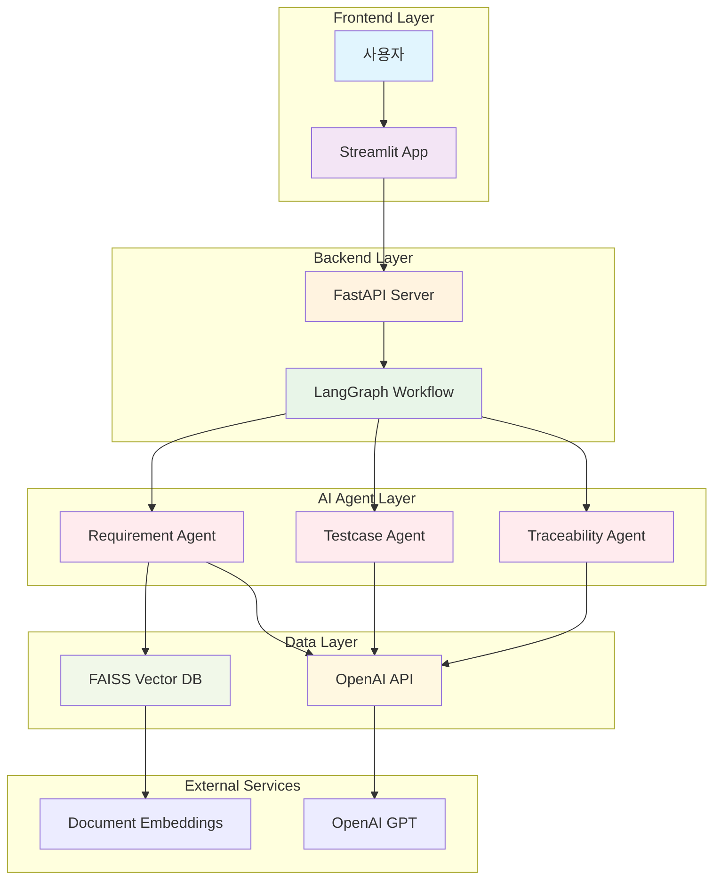
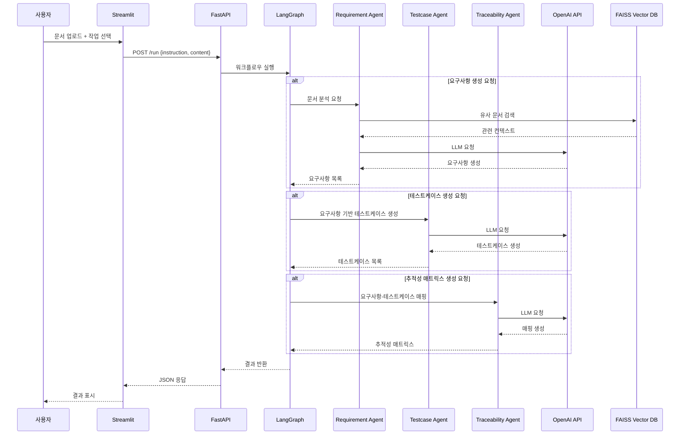
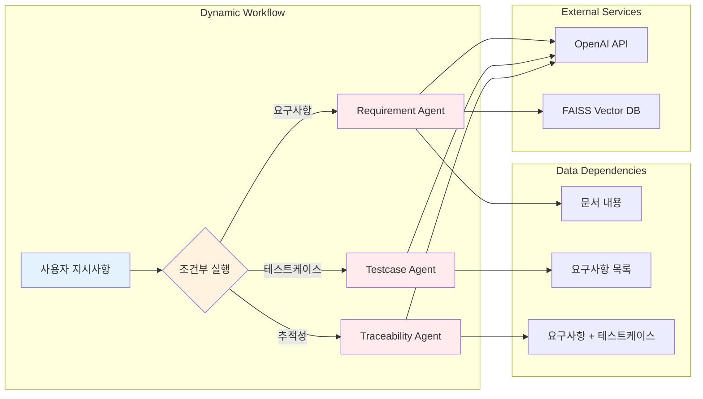

# Architecture Overview

## 1. System Context
AAWGA (AI Agent Workflow Generator Application)는 AI 에이전트 기반의 동적 워크플로우 생성 시스템입니다.

### 주요 사용자
- **프로젝트 매니저**: 요구사항 분석 및 관리
- **QA 엔지니어**: 테스트케이스 자동 생성
- **개발자**: 추적성 매트릭스 생성

### 외부 시스템
- **OpenAI API**: LLM 서비스
- **FAISS Vector DB**: 문서 임베딩 및 검색
- **Streamlit Cloud**: 프론트엔드 배포

## 2. Component Diagram

### Frontend Layer
- **Streamlit App** (`streamlit_app/main.py`)
  - 문서 업로드 인터페이스
  - 작업 선택 (요구사항/테스트케이스/추적성)
  - 결과 표시

### Backend Layer
- **FastAPI Server** (`backend/app.py`)
  - REST API 엔드포인트 (`/run`)
  - LangGraph 워크플로우 실행
  - 에러 처리 및 응답 포맷팅

### AI Agent Layer
- **Dynamic Workflow** (`agents/langgraph_dynamic.py`)
  - 사용자 지시사항에 따른 조건부 실행
  - 에이전트 간 데이터 전달

- **Individual Agents**:
  - **Requirement Agent** (`agents/requirement_agent.py`): RAG + LLM 기반 요구사항 추출
  - **Testcase Agent** (`agents/testcase_agent.py`): 요구사항 기반 테스트케이스 생성
  - **Traceability Agent** (`agents/traceability_agent.py`): 요구사항-테스트케이스 매핑

### Data Layer
- **Vector Store**: FAISS 기반 문서 임베딩 및 검색
- **RAG Service**: 관련 컨텍스트 검색 및 LLM 제공

## 3. Data Flow

### 1. 문서 업로드 및 처리
```
사용자 → Streamlit → FastAPI → 텍스트 추출
```

### 2. 동적 워크플로우 실행
```
FastAPI → LangGraph → 조건부 에이전트 실행
```

### 3. AI 에이전트 처리
```
Requirement Agent: 문서 → RAG 검색 → LLM → 요구사항
Testcase Agent: 요구사항 → LLM → 테스트케이스
Traceability Agent: 요구사항+테스트케이스 → LLM → 매핑
```

### 4. 결과 반환
```
에이전트 → LangGraph → FastAPI → Streamlit → 사용자
```

## 4. Deployment Architecture

### Development Environment
- **Backend**: `uvicorn backend.app:app --reload`
- **Frontend**: `streamlit run streamlit_app/main.py`

### Production Environment
- **Docker**: 멀티 컨테이너 배포
- **Streamlit Cloud**: 프론트엔드 자동 배포
- **Environment Variables**: API 키 및 설정 관리

## 5. System Diagram

### 전체 시스템 아키텍처


### 데이터 플로우 상세도


### 에이전트 상호작용 다이어그램


## 6. Key Features

### 동적 워크플로우
- 사용자 지시사항에 따른 조건부 에이전트 실행
- 필요한 기능만 선택적 실행

### RAG (Retrieval-Augmented Generation)
- FAISS 벡터 DB를 통한 문서 검색
- 관련 컨텍스트를 LLM에 제공하여 정확도 향상

### 더미 모드 지원
- `USE_DUMMY_AGENT=true` 환경변수로 테스트 모드 지원
- 실제 LLM 호출 없이 개발 및 테스트 가능
